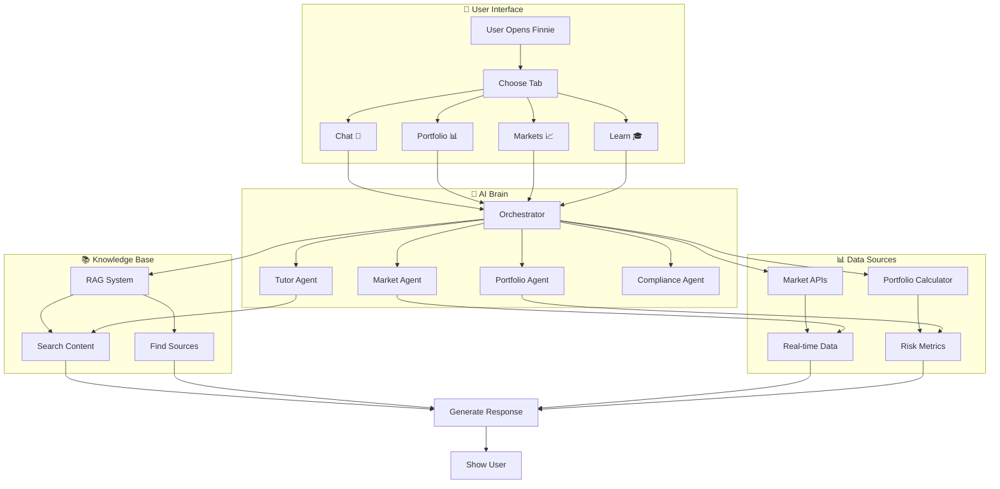
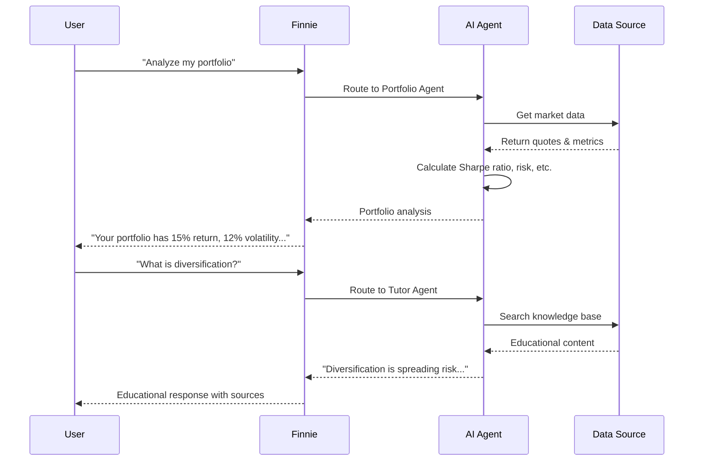
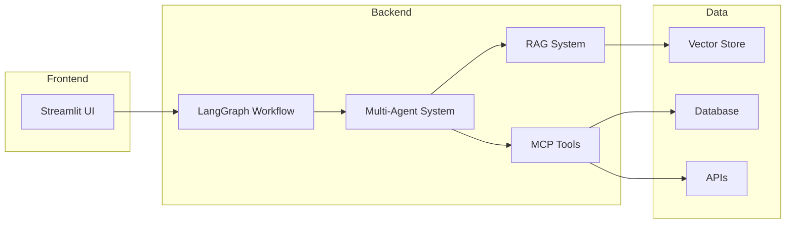
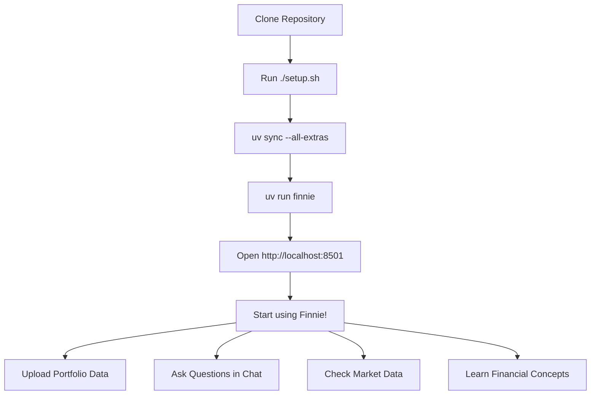
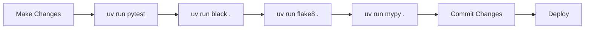

# Finnie - Quick Reference Flow Chart

## 🚀 How Finnie Works

## 🔄 User Journey Flow

## 🏗️ System Architecture

## 📋 Quick Start Flow

## 🎯 Key Features Flow

```mermaid
graph TB
    subgraph "💬 Chat Features"
        A1[Ask Questions] --> A2[Get AI Responses]
        A2 --> A3[View Sources]
        A3 --> A4[Follow-up Questions]
    end
    
    subgraph "📊 Portfolio Features"
        B1[Upload CSV] --> B2[View Analysis]
        B2 --> B3[Risk Metrics]
        B3 --> B4[Recommendations]
    end
    
    subgraph "📈 Market Features"
        C1[Watchlist] --> C2[Real-time Quotes]
        C2 --> C3[News Feed]
        C3 --> C4[Market Calendar]
    end
    
    subgraph "🎓 Learning Features"
        D1[Learning Paths] --> D2[Interactive Lessons]
        D2 --> D3[Quizzes]
        D3 --> D4[Progress Tracking]
    end
```

## 🔧 Development Flow

---

**Developed by Sankar Subbayya** | **Finnie - Financial AI Engine**
