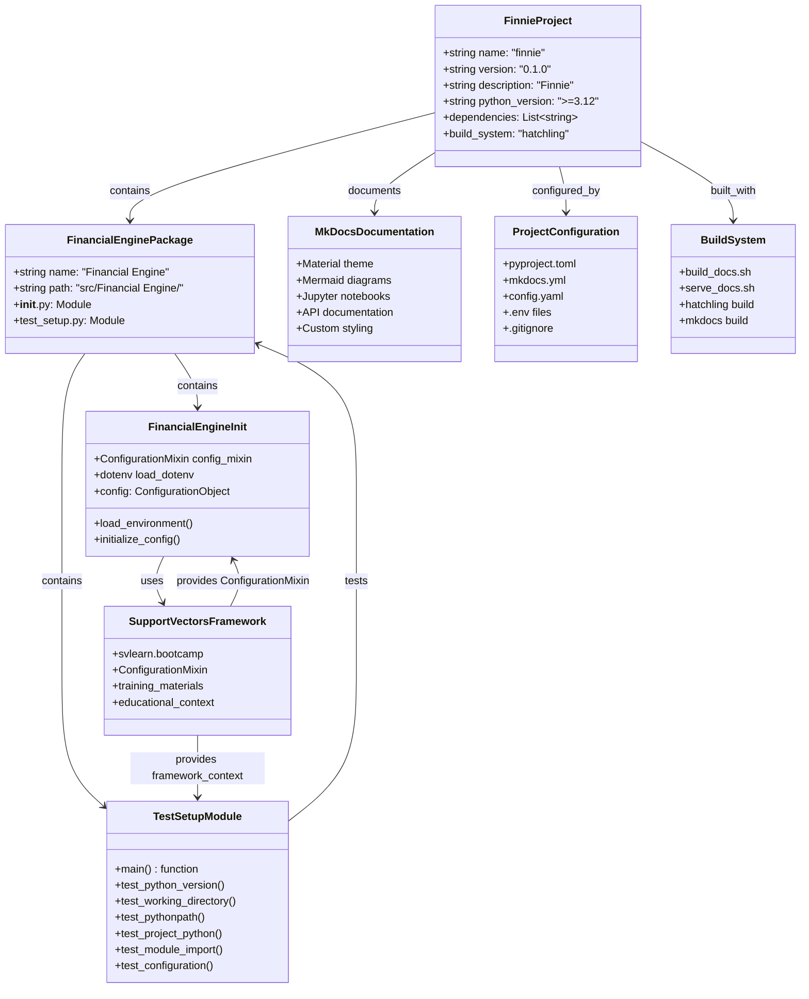
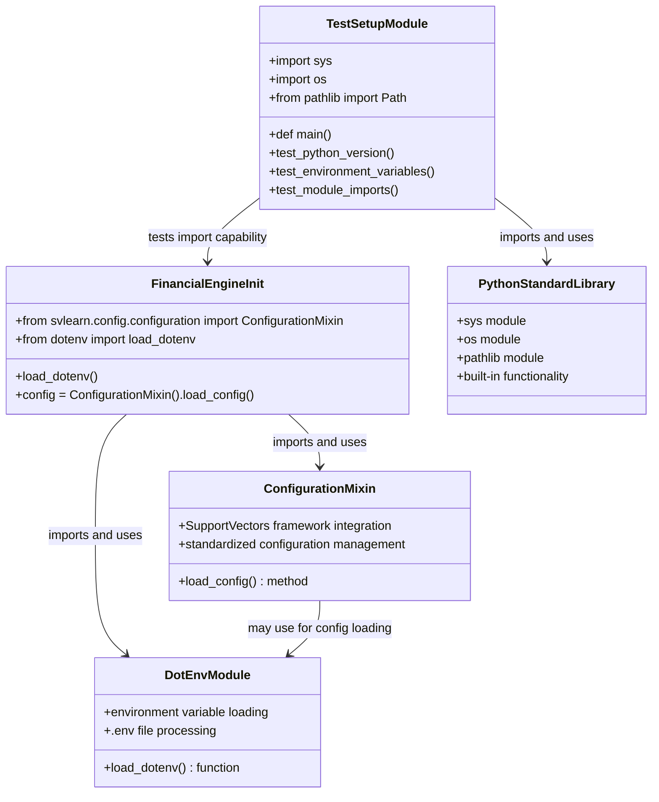
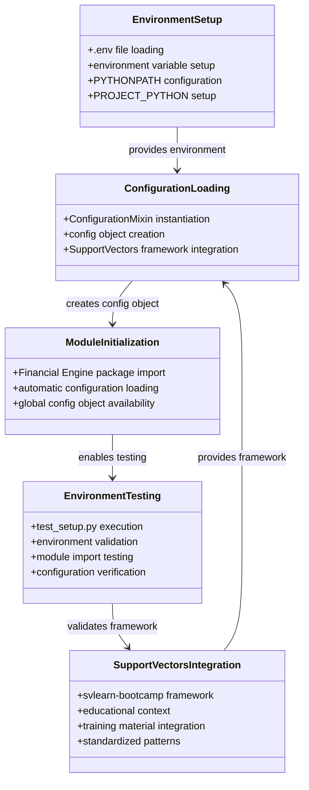
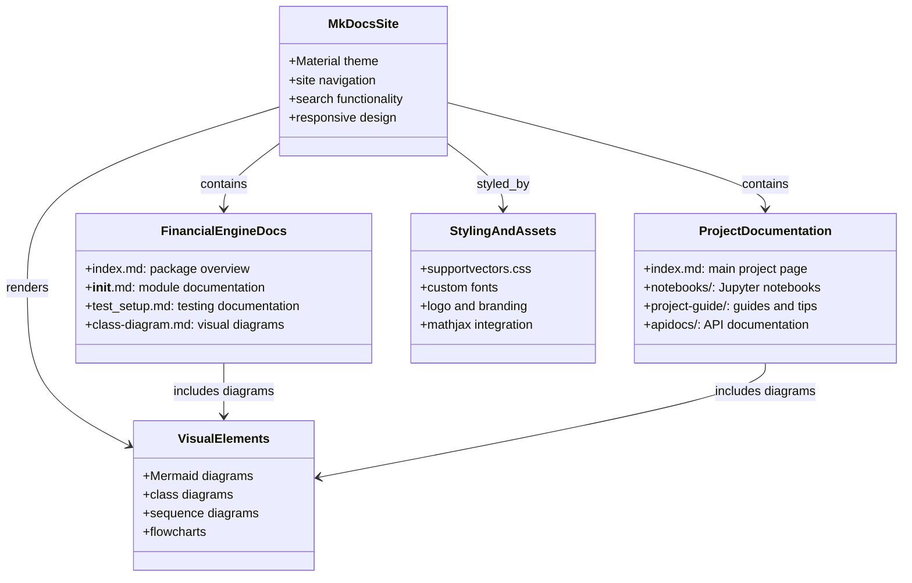

# Financial Engine - Class Diagram

## Project Structure Overview

This diagram illustrates the overall architecture and relationships within the Financial Engine package and the broader Finnie project.

## Module Dependencies Diagram

This diagram shows the specific dependencies and relationships between the core modules.

## Environment and Configuration Flow

This diagram illustrates how the environment setup and configuration loading works in the Financial Engine package.

## Documentation Structure

This diagram shows the documentation architecture and how it relates to the codebase.

## Key Relationships Summary

### Core Dependencies
- **Financial Engine Package** depends on **SupportVectors Framework** for configuration management
- **Test Setup Module** depends on **Python Standard Library** for basic functionality
- **Configuration Loading** depends on **Environment Setup** for proper initialization

### Documentation Integration
- **MkDocs Site** provides the documentation platform
- **Financial Engine Documentation** covers the core package functionality
- **Visual Diagrams** enhance understanding through Mermaid diagrams
- **Styling and Assets** provide SupportVectors branding and custom appearance

### Build and Development
- **Project Configuration** defines the build and development environment
- **Build System** handles documentation generation and serving
- **Environment Testing** validates proper setup and configuration

This architecture ensures a well-structured, documented, and maintainable financial AI project that follows SupportVectors best practices and educational standards.
