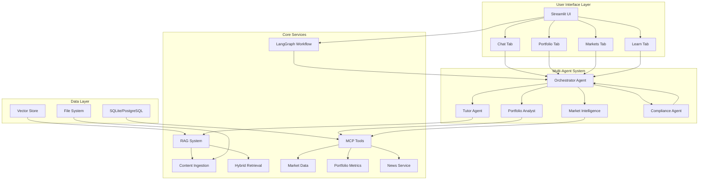
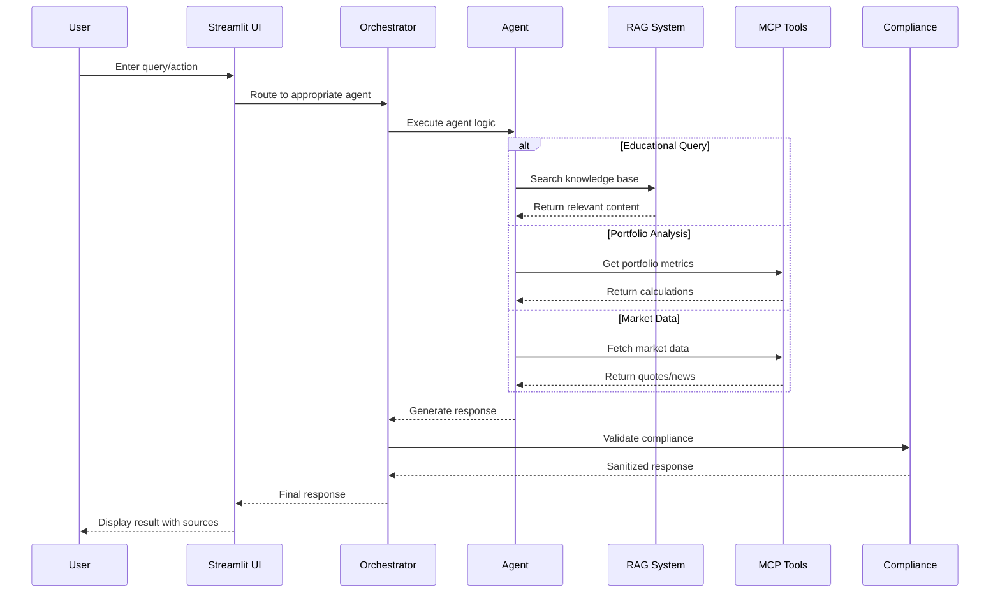
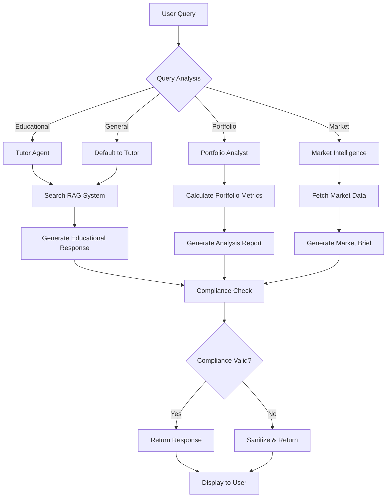
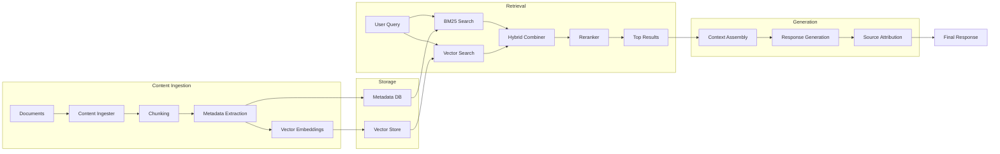
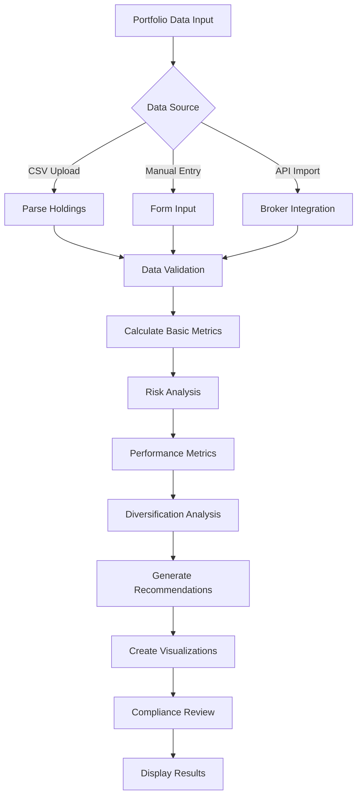
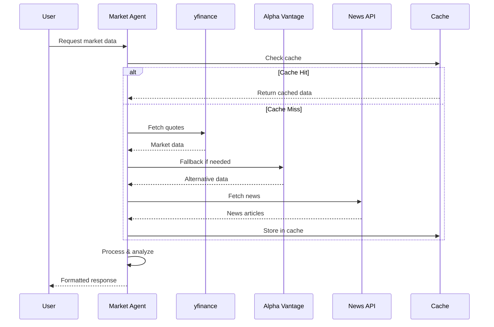
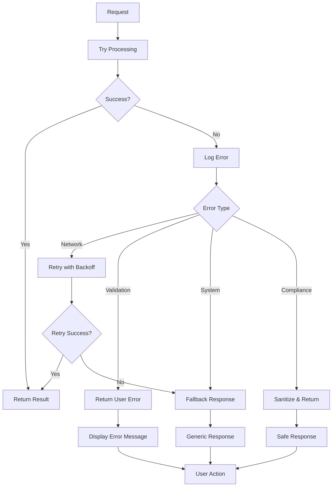
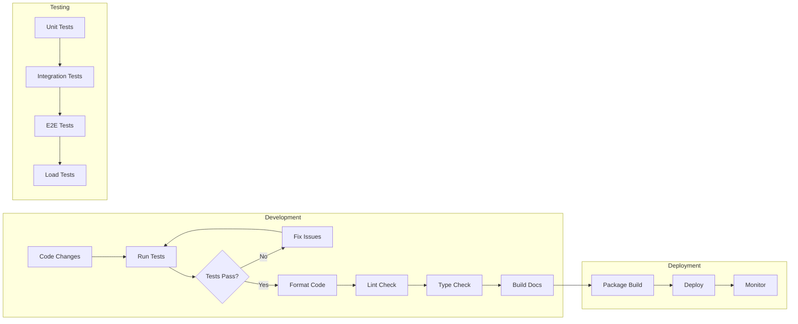
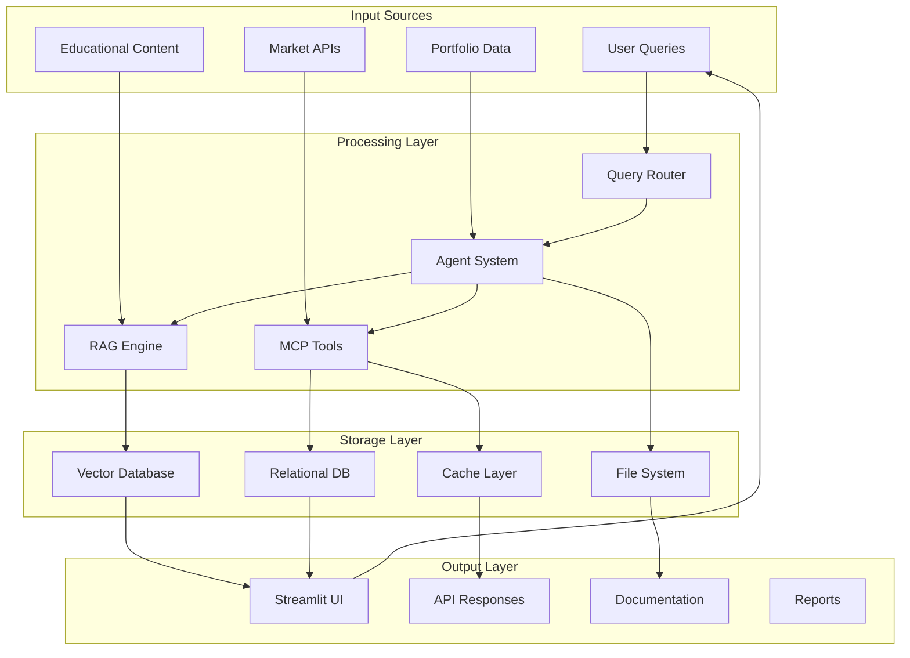

# Finnie Project Flow Chart

## System Architecture Overview

This document provides comprehensive flow charts showing the Finnie Financial AI Engine architecture, data flow, and user interactions.

## High-Level System Architecture

## User Interaction Flow

## Multi-Agent Decision Flow

## RAG System Flow

## Portfolio Analysis Flow

## Market Data Flow

## Error Handling Flow

## Development Workflow

## Data Flow Summary

## Key Components Summary

| Component | Purpose | Technology |
|-----------|---------|------------|
| **Streamlit UI** | User Interface | Streamlit, Plotly |
| **Orchestrator** | Query Routing | LangGraph |
| **Agents** | Specialized Processing | Python Classes |
| **RAG System** | Knowledge Retrieval | FAISS, BM25 |
| **MCP Tools** | External Data | yfinance, APIs |
| **Compliance** | Safety & Validation | Custom Rules |
| **Storage** | Data Persistence | SQLite, Vector DB |

This comprehensive flow chart documentation shows how all components of the Finnie Financial AI Engine work together to provide a complete financial analysis and education platform.
