# Financial Engine - Sequence Diagrams

## Package Initialization Workflow

This sequence diagram illustrates the process of initializing the Financial Engine package and loading configuration.

## Environment Testing Workflow

This sequence diagram shows the process of running the environment test to verify proper setup.

```mermaid
sequenceDiagram
    participant User
    participant TestScript as test_setup.py
    participant System as System Environment
    participant FileSystem as File System
    participant Python as Python Interpreter
    participant Module as Financial Engine Module

    User->>TestScript: python src/test_setup.py
    TestScript->>TestScript: print("🚀 SupportVectors Environment Setup Test")
    
    TestScript->>System: check Python version
    System-->>TestScript: sys.version
    TestScript->>TestScript: print("✅ Python version: {version}")
    
    TestScript->>System: check working directory
    System-->>TestScript: os.getcwd()
    TestScript->>TestScript: print("✅ Working directory: {cwd}")
    
    TestScript->>System: check PYTHONPATH
    System-->>TestScript: os.environ.get('PYTHONPATH')
    TestScript->>TestScript: print("✅ PYTHONPATH: {path}")
    
    TestScript->>System: check PROJECT_PYTHON
    System-->>TestScript: os.environ.get('PROJECT_PYTHON')
    TestScript->>TestScript: print("✅ PROJECT_PYTHON: {python}")
    
    TestScript->>FileSystem: check Python executable exists
    FileSystem-->>TestScript: file exists status
    TestScript->>TestScript: print executable status
    
    TestScript->>FileSystem: check src directory
    FileSystem-->>TestScript: directory exists
    TestScript->>FileSystem: list module directories
    FileSystem-->>TestScript: module list
    
    TestScript->>Python: sys.path.insert(0, 'src')
    TestScript->>Python: __import__(module_name)
    Python->>Module: execute module initialization
    Module-->>Python: module loaded
    Python-->>TestScript: module object
    
    TestScript->>Module: check for config attribute
    Module-->>TestScript: config object status
    TestScript->>TestScript: print configuration status
    
    TestScript->>TestScript: print("🎉 Hello World! Environment setup test completed!")
    TestScript-->>User: test results displayed
```

## Configuration Loading Workflow

This sequence diagram details the configuration loading process within the SupportVectors framework.

## Documentation Build Workflow

This sequence diagram shows the process of building the documentation using MkDocs.

## Development Workflow

This sequence diagram illustrates the typical development workflow for working with the Financial Engine package.

## Error Handling Workflow

This sequence diagram shows how errors are handled during package initialization and testing.

## Key Workflow Characteristics

### Initialization Flow
- **Environment Setup**: Loads environment variables before configuration
- **Configuration Loading**: Uses SupportVectors framework for standardized config
- **Error Handling**: Graceful handling of missing dependencies or configuration issues

### Testing Flow
- **Comprehensive Validation**: Tests all aspects of the environment
- **Diagnostic Output**: Provides clear feedback on issues
- **Progressive Testing**: Tests basic environment before complex operations

### Development Flow
- **Environment-First**: Always validate environment before development
- **Iterative Testing**: Continuous validation during development
- **Documentation Integration**: Updates documentation as part of development process

### Error Recovery
- **Clear Error Messages**: Specific guidance for common issues
- **Progressive Resolution**: Fix basic issues before complex ones
- **Validation Loop**: Re-test after fixes to ensure resolution

These workflows ensure a robust, well-tested, and maintainable Financial Engine package that follows SupportVectors best practices and educational standards.
