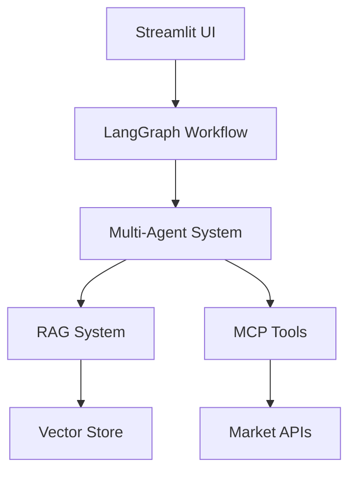

# GitHub Setup Guide for Finnie

## 🚀 Getting Finnie on GitHub

This guide will walk you through setting up your Finnie project on GitHub, including repository creation, initial commit, and CI/CD setup.

## 📋 Prerequisites

- GitHub account
- Git installed locally
- SSH key configured (recommended)

## 🔧 Step-by-Step Setup

### 1. **Create GitHub Repository**

#### Option A: Via GitHub Web Interface
1. Go to [github.com](https://github.com)
2. Click "New repository" (green button)
3. Fill in details:
   - **Repository name**: `finnie`
   - **Description**: `Financial AI Engine - Multi-agent system for portfolio analysis and financial education`
   - **Visibility**: Public (recommended for portfolio)
   - **Initialize**: Don't check any boxes (we'll add files manually)

#### Option B: Via GitHub CLI (if installed)
```bash
gh repo create finnie --public --description "Financial AI Engine - Multi-agent system for portfolio analysis and financial education"
```

### 2. **Initialize Local Git Repository**

```bash
# Navigate to your project directory
cd /Users/sankar/sankar/courses/finnie

# Initialize git repository
git init

# Add remote origin
git remote add origin https://github.com/YOUR_USERNAME/finnie.git

# Or if using SSH:
git remote add origin git@github.com:YOUR_USERNAME/finnie.git
```

### 3. **Create .gitignore File**

```bash
# Create comprehensive .gitignore
cat > .gitignore << 'EOF'
# Python
__pycache__/
*.py[cod]
*$py.class
*.so
.Python
build/
develop-eggs/
dist/
downloads/
eggs/
.eggs/
lib/
lib64/
parts/
sdist/
var/
wheels/
*.egg-info/
.installed.cfg
*.egg
MANIFEST

# Virtual environments
.env
.venv
env/
venv/
ENV/
env.bak/
venv.bak/

# IDE
.vscode/
.idea/
*.swp
*.swo
*~

# OS
.DS_Store
.DS_Store?
._*
.Spotlight-V100
.Trashes
ehthumbs.db
Thumbs.db

# Project specific
data/
logs/
*.log
.env.local
.env.production
.env.development

# Database
*.db
*.sqlite
*.sqlite3

# Vector stores
faiss_index/
chroma_db/
*.pkl
*.pickle

# Jupyter
.ipynb_checkpoints/

# pytest
.pytest_cache/
.coverage
htmlcov/

# mypy
.mypy_cache/
.dmypy.json
dmypy.json

# Docker
.dockerignore

# AWS
.aws/
*.pem
*.key

# Temporary files
tmp/
temp/
EOF
```

### 4. **Create README.md**

```bash
# Create comprehensive README
cat > README.md << 'EOF'
# 📈 Finnie - Financial AI Engine

**Developed by Sankar Subbayya**

A comprehensive financial AI engine built with multi-agent systems, RAG (Retrieval Augmented Generation), and real-time market data integration.

## 🚀 Features

- **Multi-Agent System**: 6 specialized AI agents for different financial tasks
- **RAG System**: Hybrid retrieval with FAISS/Chroma and BM25
- **Real-time Data**: Market quotes, news, and portfolio metrics
- **Streamlit UI**: Beautiful, responsive web interface
- **Educational Focus**: Built for learning and experimentation

## 🏗️ Architecture



## 🛠️ Quick Start

### Prerequisites
- Python 3.12+
- uv package manager

### Installation
```bash
# Clone the repository
git clone https://github.com/YOUR_USERNAME/finnie.git
cd finnie

# Install dependencies
uv sync --all-extras

# Run the application
uv run finnie
```

### Access the App
- Open your browser to `http://localhost:8501`
- Explore the Chat, Portfolio, Markets, and Learn tabs

## 📊 Technology Stack

- **Frontend**: Streamlit, Plotly
- **AI/ML**: LangGraph, OpenAI, FAISS
- **Data**: yfinance, Alpha Vantage, PostgreSQL
- **Infrastructure**: Docker, AWS-ready
- **Documentation**: MkDocs Material

## 🧪 Testing

```bash
# Run all tests
uv run pytest

# Run with coverage
uv run pytest --cov=src

# Format code
uv run black .

# Lint code
uv run flake8 .
```

## 📚 Documentation

```bash
# Serve documentation locally
uv run mkdocs serve

# Build documentation
uv run mkdocs build
```

## 🚀 Deployment

### Local Development
```bash
uv run streamlit run app/main.py
```

### Docker
```bash
docker build -t finnie .
docker run -p 8501:8501 finnie
```

### AWS Deployment
See [AWS Deployment Guide](aws-deployment-guide.md) for detailed instructions.

## 🤝 Contributing

1. Fork the repository
2. Create a feature branch (`git checkout -b feature/amazing-feature`)
3. Commit your changes (`git commit -m 'Add amazing feature'`)
4. Push to the branch (`git push origin feature/amazing-feature`)
5. Open a Pull Request

## 📄 License

This project is part of an educational financial AI curriculum. It follows standard open-source practices and educational guidelines for learning purposes.

## 👨‍💻 Author

**Sankar Subbayya**
- GitHub: [@your-github-username](https://github.com/your-github-username)
- Email: sankar@example.com

## 🙏 Acknowledgments

- Built with modern AI/ML frameworks
- Inspired by financial education and AI research
- Uses open-source libraries and tools

---

*Finnie - Empowering Financial AI Education through Comprehensive Documentation and Robust Architecture*
EOF
```

### 5. **Create LICENSE File**

```bash
# Create MIT License
cat > LICENSE << 'EOF'
MIT License

Copyright (c) 2025 Sankar Subbayya

Permission is hereby granted, free of charge, to any person obtaining a copy
of this software and associated documentation files (the "Software"), to deal
in the Software without restriction, including without limitation the rights
to use, copy, modify, merge, publish, distribute, sublicense, and/or sell
copies of the Software, and to permit persons to whom the Software is
furnished to do so, subject to the following conditions:

The above copyright notice and this permission notice shall be included in all
copies or substantial portions of the Software.

THE SOFTWARE IS PROVIDED "AS IS", WITHOUT WARRANTY OF ANY KIND, EXPRESS OR
IMPLIED, INCLUDING BUT NOT LIMITED TO THE WARRANTIES OF MERCHANTABILITY,
FITNESS FOR A PARTICULAR PURPOSE AND NONINFRINGEMENT. IN NO EVENT SHALL THE
AUTHORS OR COPYRIGHT HOLDERS BE LIABLE FOR ANY CLAIM, DAMAGES OR OTHER
LIABILITY, WHETHER IN AN ACTION OF CONTRACT, TORT OR OTHERWISE, ARISING FROM,
OUT OF OR IN CONNECTION WITH THE SOFTWARE OR THE USE OR OTHER DEALINGS IN THE
SOFTWARE.
EOF
```

### 6. **Initial Commit and Push**

```bash
# Add all files
git add .

# Create initial commit
git commit -m "Initial commit: Finnie Financial AI Engine

- Multi-agent system with LangGraph
- RAG implementation with FAISS/Chroma
- Streamlit UI with 4 tabs (Chat, Portfolio, Markets, Learn)
- Real-time market data integration
- Comprehensive documentation with MkDocs
- Docker and AWS deployment ready
- Developed by Sankar Subbayya"

# Push to GitHub
git push -u origin main
```

### 7. **Set Up GitHub Actions CI/CD**

```bash
# Create GitHub Actions directory
mkdir -p .github/workflows

# Create CI workflow
cat > .github/workflows/ci.yml << 'EOF'
name: CI/CD Pipeline

on:
  push:
    branches: [ main, develop ]
  pull_request:
    branches: [ main ]

jobs:
  test:
    runs-on: ubuntu-latest
    
    steps:
    - uses: actions/checkout@v3
    
    - name: Set up Python 3.12
      uses: actions/setup-python@v4
      with:
        python-version: '3.12'
    
    - name: Install uv
      run: pip install uv
    
    - name: Install dependencies
      run: uv sync --all-extras
    
    - name: Run tests
      run: uv run pytest
    
    - name: Run linting
      run: |
        uv run black --check .
        uv run flake8 .
        uv run mypy .
    
    - name: Build documentation
      run: uv run mkdocs build
    
    - name: Upload coverage reports
      uses: codecov/codecov-action@v3
      with:
        file: ./coverage.xml
        flags: unittests
        name: codecov-umbrella

  docker:
    runs-on: ubuntu-latest
    needs: test
    
    steps:
    - uses: actions/checkout@v3
    
    - name: Build Docker image
      run: docker build -t finnie .
    
    - name: Test Docker image
      run: |
        docker run -d --name finnie-test -p 8501:8501 finnie
        sleep 10
        curl -f http://localhost:8501/_stcore/health || exit 1
        docker stop finnie-test
EOF
```

### 8. **Set Up GitHub Pages for Documentation**

```bash
# Create GitHub Pages workflow
cat > .github/workflows/docs.yml << 'EOF'
name: Deploy Documentation

on:
  push:
    branches: [ main ]
    paths: [ 'docs/**', 'mkdocs.yml' ]

jobs:
  deploy:
    runs-on: ubuntu-latest
    
    steps:
    - uses: actions/checkout@v3
    
    - name: Set up Python 3.12
      uses: actions/setup-python@v4
      with:
        python-version: '3.12'
    
    - name: Install uv
      run: pip install uv
    
    - name: Install dependencies
      run: uv sync --all-extras
    
    - name: Build documentation
      run: uv run mkdocs build
    
    - name: Deploy to GitHub Pages
      uses: peaceiris/actions-gh-pages@v3
      with:
        github_token: ${{ secrets.GITHUB_TOKEN }}
        publish_dir: ./site
EOF
```

### 9. **Configure Repository Settings**

#### Enable GitHub Pages:
1. Go to repository Settings
2. Scroll to "Pages" section
3. Source: "GitHub Actions"
4. Save

#### Set up branch protection:
1. Go to Settings → Branches
2. Add rule for `main` branch
3. Enable:
   - Require pull request reviews
   - Require status checks to pass
   - Require branches to be up to date

### 10. **Add Repository Topics and Description**

Go to your repository and add these topics:
- `financial-ai`
- `streamlit`
- `langgraph`
- `rag`
- `portfolio-analysis`
- `machine-learning`
- `python`
- `multi-agent-system`

## 🎯 Repository Structure

Your GitHub repository will have this structure:

```
finnie/
├── .github/
│   └── workflows/
│       ├── ci.yml
│       └── docs.yml
├── app/
│   ├── main.py
│   ├── utils.py
│   └── pages/
├── agents/
├── graph/
├── rag/
├── tools/
├── docs/
├── tests/
├── Dockerfile
├── docker-compose.yml
├── mkdocs.yml
├── pyproject.toml
├── README.md
├── LICENSE
└── .gitignore
```

## 🚀 Next Steps

### 1. **Create Issues and Project Board**
- Create GitHub Issues for features and bugs
- Set up Project Board for task management
- Add labels: `enhancement`, `bug`, `documentation`, `good first issue`

### 2. **Set up Code Quality**
- Enable Dependabot for dependency updates
- Set up CodeQL for security scanning
- Configure branch protection rules

### 3. **Add Badges to README**
```markdown


```

### 4. **Create Release**
```bash
# Create first release
git tag -a v1.0.0 -m "Initial release of Finnie Financial AI Engine"
git push origin v1.0.0
```

## 📊 GitHub Features to Enable

- **Issues**: For bug reports and feature requests
- **Projects**: For project management
- **Wiki**: For additional documentation
- **Discussions**: For community discussions
- **Actions**: For CI/CD (already set up)
- **Pages**: For documentation hosting
- **Security**: For vulnerability scanning

## ✅ Checklist

- [ ] GitHub repository created
- [ ] Local git repository initialized
- [ ] Files committed and pushed
- [ ] README.md created with comprehensive information
- [ ] LICENSE file added
- [ ] .gitignore configured
- [ ] GitHub Actions CI/CD set up
- [ ] GitHub Pages configured
- [ ] Repository topics added
- [ ] Branch protection rules set
- [ ] First release tagged

## 🎉 You're All Set!

Your Finnie project is now on GitHub with:
- ✅ Professional README
- ✅ CI/CD pipeline
- ✅ Documentation hosting
- ✅ Code quality checks
- ✅ Docker support
- ✅ AWS deployment ready

**Repository URL**: `https://github.com/YOUR_USERNAME/finnie`

---

*Developed by Sankar Subbayya | Finnie - Financial AI Engine*
EOF
