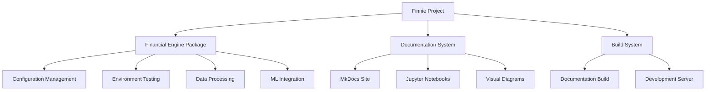

# Finnie - Financial AI Engine

**Developed by Sankar Subbayya**

## Project Overview

**Finnie** is a comprehensive financial AI engine designed for modern financial analysis and education. This project provides a robust foundation for financial data analysis, machine learning, and educational content delivery.

## What is Finnie?

Finnie is a Python-based financial analysis framework that combines:

- **Financial Data Processing**: Tools for cleaning, transforming, and analyzing financial datasets
- **Machine Learning Integration**: Seamless integration with scikit-learn and other ML libraries
- **Educational Focus**: Designed specifically for learning and experimentation in financial AI
- **Educational Framework**: Built on modern AI/ML frameworks for consistent learning experience

## Key Features

### 🏗️ **Modular Architecture**
- Clean, extensible package structure
- Separation of concerns between data processing, analysis, and visualization
- Easy integration with existing financial workflows

### 📊 **Comprehensive Data Analysis**
- Built-in support for time series analysis
- Statistical modeling and regression tools
- Risk assessment and portfolio optimization utilities
- Interactive visualization capabilities

### 🎓 **Educational Excellence**
- Designed for learning and experimentation
- Comprehensive documentation with visual diagrams
- Step-by-step tutorials and examples
- Integration with Jupyter notebooks for interactive learning

### 🔧 **Developer-Friendly**
- Robust environment testing and validation
- Clear error messages and troubleshooting guides
- Comprehensive logging and debugging tools
- Automated documentation generation

## Project Structure

```
finnie/
├── src/
│   └── Financial Engine/          # Core package
│       ├── __init__.py           # Package initialization
│       └── test_setup.py         # Environment testing
├── docs/                         # Documentation
│   ├── Financial Engine/         # Package documentation
│   ├── notebooks/                # Jupyter notebooks
│   └── project-guide/            # Guides and tutorials
├── tests/                        # Test suite
└── configuration files           # Project configuration
```

## Quick Start

### Prerequisites

- Python 3.12+
- uv package manager (recommended)
- Git

### Installation

1. **Clone the repository**
   ```bash
   git clone <repository-url>
   cd finnie
   ```

2. **Install dependencies**
   ```bash
   uv sync
   ```

3. **Verify installation**
   ```bash
   python src/test_setup.py
   ```

4. **Start development**
   ```python
   from Financial Engine import config
   # Your financial AI journey begins here!
   ```

## Documentation

### 📚 **Comprehensive Documentation**
- [Financial Engine Package](Financial%20Engine/index.md) - Core package documentation
- [API Reference](Financial%20Engine/__init__.md) - Detailed API documentation
- [Testing Guide](Financial%20Engine/test_setup.md) - Environment testing utilities
- [Visual Diagrams](Financial%20Engine/class-diagram.md) - Architecture and relationships
- [Workflow Diagrams](Financial%20Engine/sequence-diagrams.md) - Process flows and interactions

### 🎯 **Learning Resources**
- [Jupyter Notebooks](notebooks/) - Interactive tutorials and examples
- [Project Guide](project-guide/) - Step-by-step guides and best practices
- [Tips and Tricks](project-guide/tips-and-tricks/) - Advanced techniques and troubleshooting

## Architecture Overview

### Core Components



### Key Relationships

- **Financial Engine** is the core package containing all business logic
- **Configuration Management** handles environment setup and settings
- **Environment Testing** ensures proper development environment
- **Documentation System** provides comprehensive learning materials
- **Build System** automates documentation generation and serving

## Technology Stack

### Core Technologies
- **Python 3.12+**: Modern Python with latest features
- **Educational Framework**: Modern AI/ML learning framework
- **MkDocs Material**: Beautiful, responsive documentation
- **Jupyter Notebooks**: Interactive learning environment

### Data Science Stack
- **NumPy**: Numerical computing
- **Pandas**: Data manipulation and analysis
- **Scikit-learn**: Machine learning algorithms
- **Matplotlib/Seaborn**: Data visualization
- **Plotly**: Interactive visualizations

### Development Tools
- **uv**: Fast Python package management
- **MkDocs**: Documentation generation
- **Mermaid**: Diagram generation
- **Git**: Version control

## Getting Help

### 📖 **Documentation**
- Start with the [Financial Engine Package Overview](Financial%20Engine/index.md)
- Check the [API Reference](Financial%20Engine/__init__.md) for detailed function documentation
- Use the [Visual Diagrams](Financial%20Engine/class-diagram.md) to understand architecture

### 🐛 **Troubleshooting**
- Run `python src/test_setup.py` to diagnose environment issues
- Check the [Tips and Tricks](project-guide/tips-and-tricks/) for common solutions
- Review error messages carefully - they often contain specific guidance

### 💬 **Support**
- This is an educational financial AI project
- Follow the educational guidelines and best practices
- Use the provided examples and tutorials as starting points

## Contributing

This project is part of an educational financial AI curriculum. Contributions should follow:

- **Educational Focus**: Maintain the learning-oriented nature of the project
- **Documentation Standards**: Update documentation for any changes
- **Code Quality**: Follow Python best practices and educational guidelines
- **Testing**: Ensure all changes pass environment validation

## License

This project is part of an educational financial AI curriculum. It follows standard open-source practices and educational guidelines for learning purposes.

---

*Finnie - Empowering Financial AI Education through Comprehensive Documentation and Robust Architecture*
